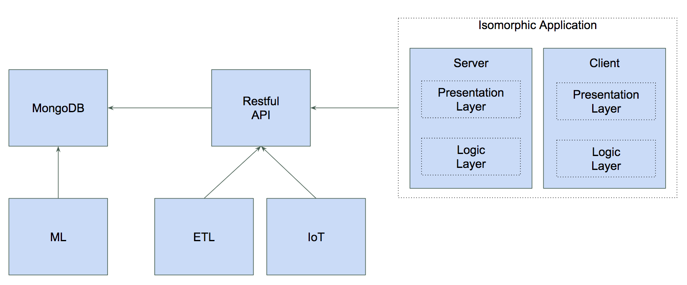

Fullstack JS Demo
====

Javascript everywhere: REST API, FE, ETL, DB, ML, IoT

Components
----

Links
----

[Rest API](https://github.com/jgarciadiaz/demo-events/tree/master/api-events)

[FE](https://github.com/jgarciadiaz/demo-events/tree/master/site-events)

[ETL](https://github.com/jgarciadiaz/demo-events/tree/master/etl-events)

[ML](https://github.com/jgarciadiaz/demo-events/tree/master/ml-events)

[IoT](https://github.com/jgarciadiaz/demo-events/tree/master/iot-weather)

[Docker commands](https://github.com/jgarciadiaz/demo-events/tree/master/docker)

[Docker images](https://hub.docker.com/)
