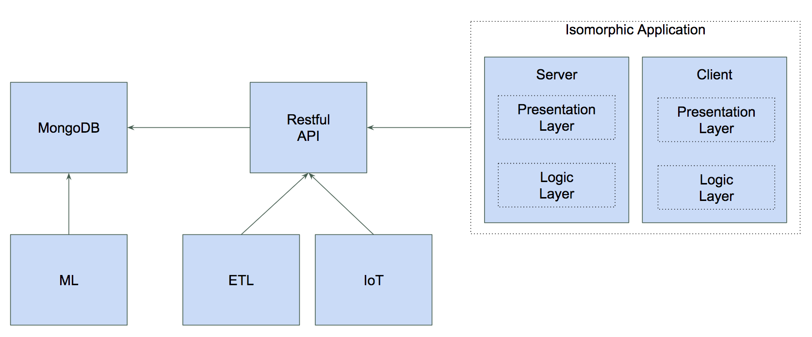

Fullstack JS Demo
====

Javascript everywhere: BE, FE, Scripts, DB, Cache

Components
----

Links
----

[BE Rest API](https://github.com/jgarciadiaz/demo-events/tree/master/be-app)

[FE](https://github.com/jgarciadiaz/demo-events/tree/master/fe-app)

[Ingestor](https://github.com/jgarciadiaz/demo-events/tree/master/ingestor)

[Docker commands](https://github.com/jgarciadiaz/demo-events/tree/master/docker)

[Docker images](https://hub.docker.com/)

Improves:
change order demo
mention JS on mongodb
Try different color for the terminal
Try Curl for Graphql instead that browser (poor zoom)
play with temperature and which events demo shows
ngnix run asset statics
enable routes on ngnix 
add a summary presentation
